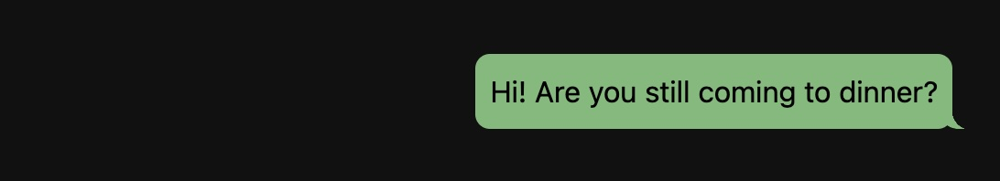
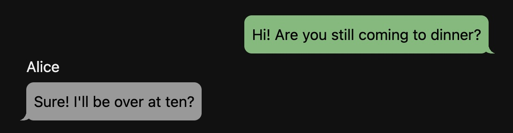
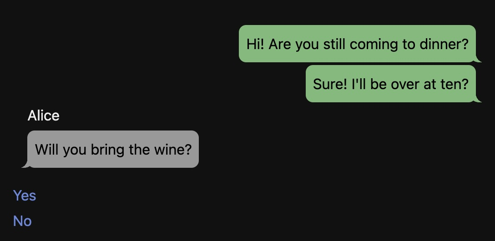
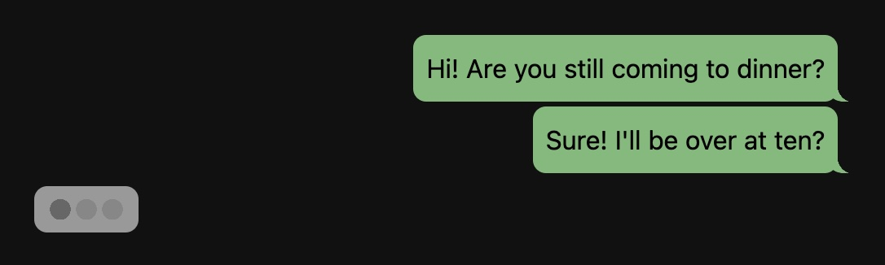
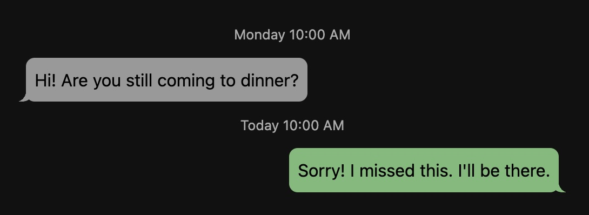
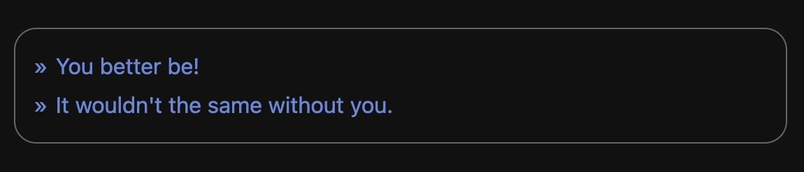

## CHATSYSTEM Macros

The Chatsystem macros are intended to provide an emulation of chat message interfaces like text messages, chat apps, and phones. It is *not* a phone simulation, it's up to the game author where they want to embed the chat interface.

**Basic Example**
```html
<<msg from "Tom" to "Alice">>         
    Hi! Are you still coming to dinner?
<</msg>>
<<chat "Tom" with "Alice">><</chat>>  
```



### Installation

Add the contents of [chat.js](chat.js) to your story Javascript.

Add the contents of [chat.css](chat.css) to your story Stylesheet.

## Settings

You can change settings for the Chatsystem by setting values on `setup["@CHATSYSTEM/Options"]`. 

Available settings:

* `setup["@CHATSYSTEM/Options"].tails (default: true)`  
   Boolean, should message bubbles show the little tails or not.
* `setup["@CHATSYSTEM/Options"].styled (default: false)`  
   Boolean, should the chat response area be styled.

## Core Concepts

The basic building block of the Chatsystem is the `<<msg>>` macro. Each one defines a **message** between one or more people, identified by names. One or more messages makes up a **conversation**, which can be displayed by the `<<chat>>` or `<<history>>` macros. You can define messages in advance and then display them as a complete conversation, or you can define them live in a simulation of live chat.

Individual messages have an author (the `from`) and one or more targets (the `to`). As soon as you create a message it makes a matching conversation. For example, the following message: `<<msg from "Tom" to "Alice">>` creates the conversation `alice_tom`. The message `<<msg from "Tom" to "Alice" and "Bob">>` creates the conversation `alice_bob_tom`. (Conversation IDs are always the names of the people involved, converted to lower case, in alphabetical order, and connected by underscores). The order of the names doesn't matter, `<<msg from "Tom" to "Alice" and "Bob">>` goes in the same conversation as `<<msg from "Tom" to "Bob" and "Alice">>`.

You can display that conversation from the point of view of one of the people using `<<history>>`. `<<history "Tom" with "Alice">>` shows the `alice_tom` conversation from Tom's point of view. `<<history "Alice" with "Tom">>` shows the same conversation from Alice's.

## Interactive Chats

You can turn a conversation into an interactive one for the player using the `<<chat>>` macro. The contents of the `<<chat>>` macro are used to present a prompt to the user allowing them to choose options and add new messages to the chat. (Note that the prompts are not styled in any particular way, to allow the story author to choose something that fits their game).

**For example:**
```html
<<msg from "Tom" to "Alice">>         
    Hi! Are you still coming to dinner?
<</msg>>
<<chat "Tom" with "Alice">>
    <<link "Sure!">>
        <<msg from "Tom" to "Alice">>
            Sure! I'll be over at ten?
        <</msg>>
    <</link>>
<</chat>>  
```



Each message in a conversation has an ID. You can provide one yourself (see [`<<msg>>`](#msg) below for more details), if you don't then they are automatically numbered in order, starting at 0. Inside the `<<chat>>` macro, the current ID (the most recent message) is available in the temporary variable `_curr`. You can use those to choose what options to display. In this way you can build an entire conversation.

**For example:**
```html
<<msg from "Tom" to "Alice">>         
    Hi! Are you still coming to dinner?
<</msg>>
<<chat "Tom" with "Alice">>
    <<if _curr == 0>>
        <<link "Sure!">>
            <<msg from "Tom" to "Alice">>
                Sure! I'll be over at ten?
            <</msg>>
            <<msg from "Alice" to "Tom">>
                Will you bring the wine?
            <</msg>>
        <</link>>
    <</if>>
    <<if _curr == 2>>
        <<link "Yes">>
            <<msg from "Tom" to "Alice">>
                I'm on it.
            <</msg>>
        <</link>>
        <<link "No">>
            <<msg from "Tom" to "Alice">>
                I don't drink, remember?
            <</msg>>
        <</link>>
    <</if>>
<</chat>>  
```


If there are more than two people in a chat, the names of the posters will appear before each group of messages they post.

### Typing Indicator

You can display a **typing indicator** to show that the other person is replying by adding a **delay** to a message.
```html
    <<if _curr == 0>>
        <<link "Sure!">>
            <<msg from "Tom" to "Alice">>
                Sure! I'll be over at ten?
            <</msg>>
            <<msg from "Alice" to "Tom" delay "4s">>
                Will you bring the wine?
            <</msg>>
        <</link>>
    <</if>>
```


### Dates and Times

If the first message in a conversation has a date (specified with `date`), and the `<<chat>>` or `<<history>>` macro *also* has a date (specified with `at`), then the date of the message will be displayed at the top of the conversation (e.g. "Today 10am", "Yesterday 2pm", "Tues, 10th, 5:30pm"), and subsequently when messages are separated by at least an hour. Times are displayed relative to the date attached to the chat itself.

**For example:**
```html
<<msg from "Tom" to "Alice" date "2025-11-17 10:00:00">>         
    Hi! Are you still coming to dinner?
<</msg>>
<<msg from "Alice" to "Tom" date "2025-11-19 10:00:00">>         
    Sorry! I missed this. I'll be there.
<</msg>>
<<history "Alice" with "Tom" at "2025-11-19 11:00:00">>
```


### Styled User Prompts

Although the `<<chat>>` macro deliberately doesn't style the user response area, leaving it up to the game author to make it match the other links in their game. However an optional styled version exists for authors who don't want to do it themselves. You can opt into that by changing the `styled` config option:
```js
setup["@CHATSYSTEM/Options"].styled = true;
```
With this setting on, the `<<chat>>` macro will style the response area as a basic text box with any links inside turned into suggested chat messages, as illustrated below:



### Scrolling

By default the chat display has no max height, and will just expand with the number of messages. If you set the `--chat-max-height` CSS variable, the chat will scroll to the bottom on load and when new messages are added.

---
## Macros

In the following macro definitions, items in `[square brackets]` are optional.

### `<<msg>>`

*Syntax*: `<<msg from "Person" to "Person" [and "Person" ...] [at "date"] [id "id"] [delay "delay"] [title "title"]>>`  
*Syntax*: `<<msg {options object}>>`

The `<<msg>>` macro adds a message to a conversation. If the conversation doesn't already exist, it will create it first. You must supply at least the `from` and `to` arguments, to indicate the sender and recipient of the message. If you wish to make a group message, either supply an array as the `to` value, or separate multiple recipients with `and`. e.g. `<<msg from "A" to "B" and "C">>`.

You can supply a `date` for a message, in a format comprehensible to the JS `Date` object (I suggest `YYYY-MM-DD HH:MM:SS`), or as a JS `Date` object. If the messages in a conversation have dates they will be automatically sorted in date order, and will display dates in a chat that also has a date (see [above](#dates-and-times)).

You can supply an `id` for a message, which can be any number or string. This will replace the automatic numeric ID of the message, and can be used in `<<chat>>` to test where you are in the current conversation.

You can supply a `delay` for a message, which can be any time string usable by the `<<timed>>` macro. If the message is being displayed live as part of a `<<chat>>` this will display a typing animation, and delay adding the message for that long.

You can supply a `title` for a message, which can be any string. If you do, it will display above the message in the same place a date stamp would. If a message would show both a date and title, it shows the title.

You can replace all the arguments with a message object, with at least the keys: `{ from: "Person", to: ["People"] }`.

> [!NOTE]
> The contents of a `<<msg>>` may contain Twinescript, but this will be converted to plain HTML at the time the message is created. i.e. the contents of a message is always static text. This means a message's content is fixed, and won't change later even if it included a variable that changes later. 
> This is deliberate to make sure that a message displayed later in the game appears the same as if it was displayed earlier. If you *want* to change a message's content later in the game you will need to alter the stored conversation later. See: [data structures](#data-structures).

### `<<msg-delete>>`

*Syntax*: `<<msg-delete from "Person" to "Person" [and "Person" ...] id "id">>`

The `<<msg-delete>>` macro deletes a message from a conversation. Specify the conversation in the same way as you would when creating the message.

### `<<history>>`

*Syntax*: `<<history "Person" with "Person" [and "Person" ...] [at "date"]>>`  
*Syntax*: `<<history {options object}>>`

The `<<history>>` macro displays a conversation. If the conversation doesn't already exist, or is empty, then it will not display anything. You must supply at least two people to identify a valid conversation.

You can supply a `date` to the conversation, in a format comprehensible to the JS `Date` object (I suggest `YYYY-MM-DD HH:MM:SS`), or as a JS `Date` object. If the conversation has a date, and at least the first message in it also has, then dates will be displayed alongside the messages.

If the converastion has more than two participants, it will show names above each group of posts.

### `<<chat>>`

*Syntax*: `<<chat "Person" with "Person" [and "Person" ...] [at "date"]>><</chat>>`  
*Syntax*: `<<chat {options object}>><</chat>>`

The `<<chat>>` macro displays a conversation along with a "live" prompt for the player to pick options that add more messages to the conversation. Options can be presented using standard macros like `<<link>>` and `<<button>>`. Adding new messages automatically refreshes both the chat and options pane.

The contents of the macro has access to the `_curr` temporary variable, which tracks the most recent message in the conversation. The story author can use this to choose what options to display with standard macros, like `<<if>>` and `<<switch>>`. See [interactive chats](#interactive-chats) above for an example.

### `<<chat-delete>>`

*Syntax*: `<<chat-delete "Person" with "Person" [and "Person" ...]>>`

The `<<chat-delete>>` macro deletes an entire conversation.

---
## Objects and Functions

A number of utility functions are available as `CHATSYSTEM.function()`.

### `CHATSYSTEM.addMsg(chat_id,msg)`

Given a chat id and a message object, adds that message to the chat. If the message has a date, the messages in the chat will be sorted. 

> [!WARNING]
> `addMsg` does *not* perform any validation on the message of the type done by `<<msg>>`

### `CHATSYSTEM.addTyping(chat_id)`

Given a chat id, adds a typing indicator to the chat if it is currently displayed. The indicator will remain in place until you refresh the chat with `<<redo "chat_id">>` or otherwise refresh the passage.

### `CHATSYSTEM.conversationId(from,to)`

Given a `from` and `to` value, where `from` is a string, and `to` is a string or array, returns the corresponding chat id. e.g. `CHATSYSTEM.conversationId("a",["b","c"]) => a_b_c`.

### `CHATSYSTEM.currentId(chat_id)`

Given a chat id, returns the id of the most recent message, the same as `_curr`

### `CHATSYSTEM.date(now,then)`

Given a pair of valid JS `Date` objects, the first of which represents the "current time", returns a formated date string like the one that appears above a message in `<<history>>` and `<<chat>>`

### `CHATSYSTEM.deleteChat(chat_id)`

Given a chat id, deletes that chat. The same as `<<chat-delete>>`.

### `CHATSYSTEM.deleteMsg(chat_id,msg_id)`

Given a chat id, and a message id deletes that message. The same as `<<msg-delete>>`.

### `CHATSYSTEM.initChat(chat_id)`

Given a chat id, creates that conversation.

---
## Data Structures

The Chatsystem stores chats in the `$chatsystem` story variable. This is an object, whose keys are conversation ids. Each value is an array of message objects.

```js
{
    alice_tom: [
        { from: "Tom",   id: 0, text: "Hi! Are you still coming to dinner?",  to: [ "Alice" ] }
        { from: "Alice", id: 1, text: "Sorry! I missed this. I'll be there.", to: [ "Tom" ]   }
    ]
​​}
```

Chatsystem configuration is contained in the `setup["@CHATSYSTEM/Options]` variable. This is an object, whose keys are settings.

```js
{ tails: true }
```

---
## Themeing

You can theme the chat display using CSS variables. The following variables are available (along with their defaults):

```css
  --chat-from-color:     #7B7;
  --chat-to-color:       #999;
  --chat-msg-text-color: black;
  --chat-title-color:    white;
  --chat-type-dim:       #666;
  --chat-type-bright:    #888;
  --chat-max-height:     auto;
```

---
## HTML Structure

Conversations are displayed inside instances of `.chat_container`. The messages are contained in `.chat_sequence` and the user input area (if any) in `.chat_response`. 

Individual messages are displayd in `.chat_msg` instances. Each message has a class of `chat_msg_to` if it is addressed to the current Person, and `chat_msg_from` if it is from that Person. In addition every message has a class of `chat_msg_NAME` where `NAME` is the message author's name (in lowercase, with spaces replaced with '_').

Date/Title elements have the class `.date`. Person names have the class `.chat_from` and also `.chat_name_NAME` where `NAME` is the message author's name (in lowercase, with spaces replaced with '_').

```html
<div class="chat_container">
    <div class="macro-do redo-target" data-do-tags="CONVERSATION_ID">
        <div class="chat_sequence" id="CONVERSATION_ID">
            <div class="wrapper">
                <div class="date">MESSAGE_DATE_OR_TITLE</div>
                <div class="chat_msg chat_msg_to chat_name_NAME">MESSAGE_DATE_OR_TITLE</div>
                <div class="chat_msg chat_msg_to chat_msg_NAME tails">
                        <p>Hi! Are you still coming to dinner?</p>
                </div>
                <div class="date">MESSAGE_DATE_OR_TITLE</div>
                <div class="chat_msg chat_msg_to chat_msg_NAME tails">
                        <p>Sorry! I missed this. I'll be there.</p>
                </div>
            </div>
        </div>
        <div class="chat_response">
            CONTENTS_OF_CHAT_MACRO
        </div>
    </div>
</div>
```